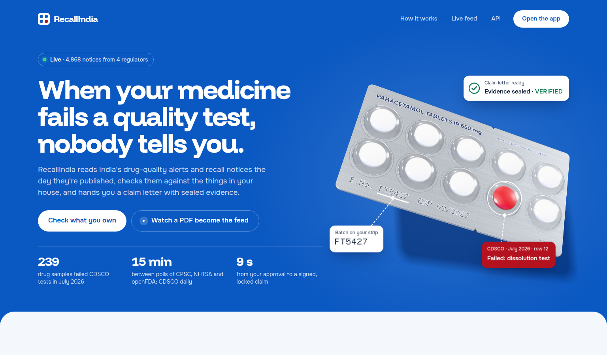
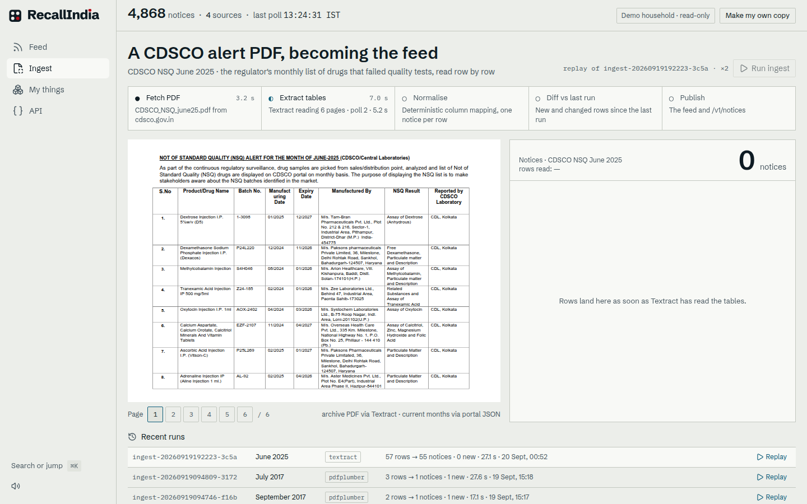
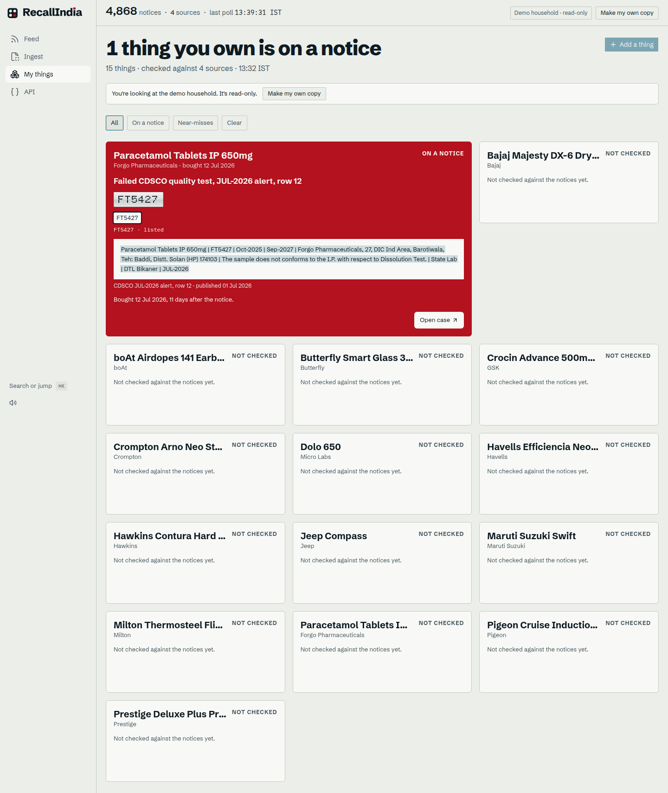
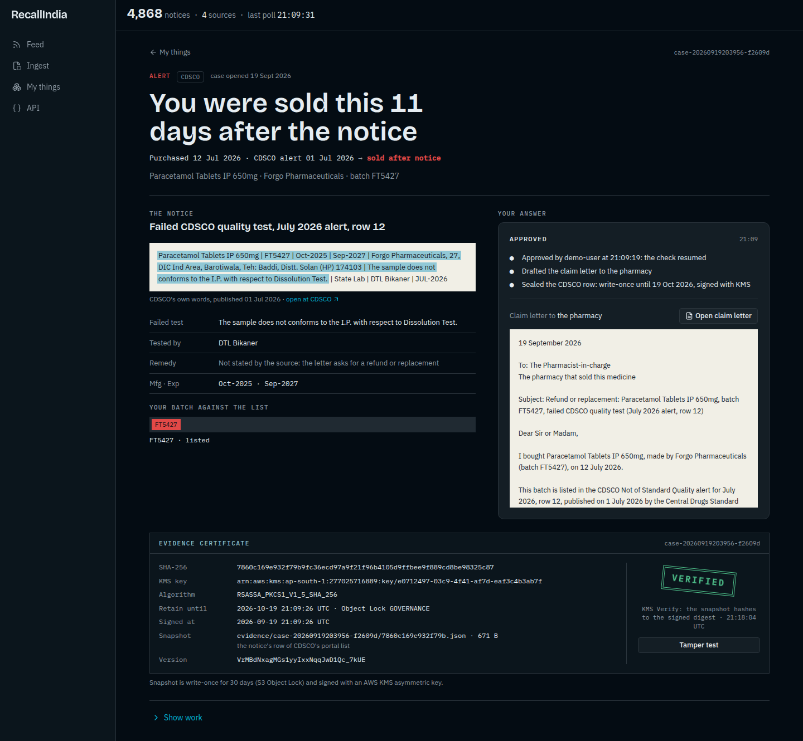
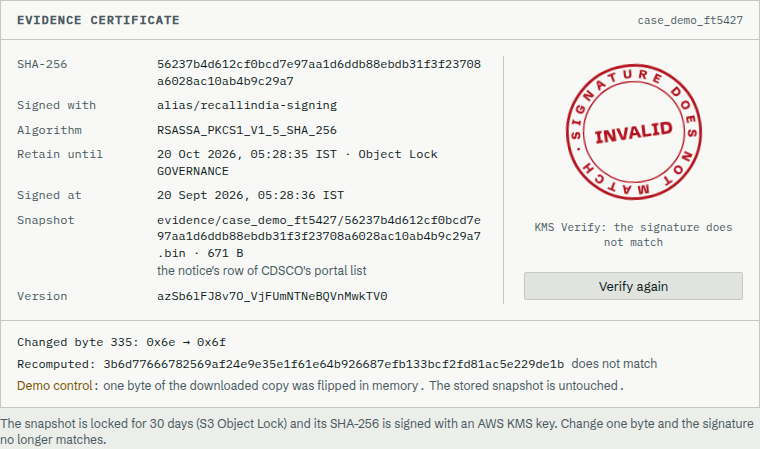
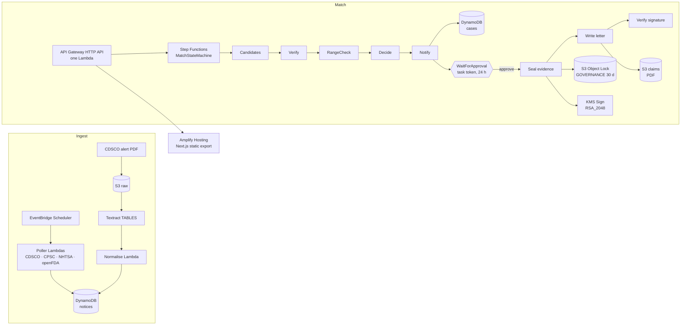
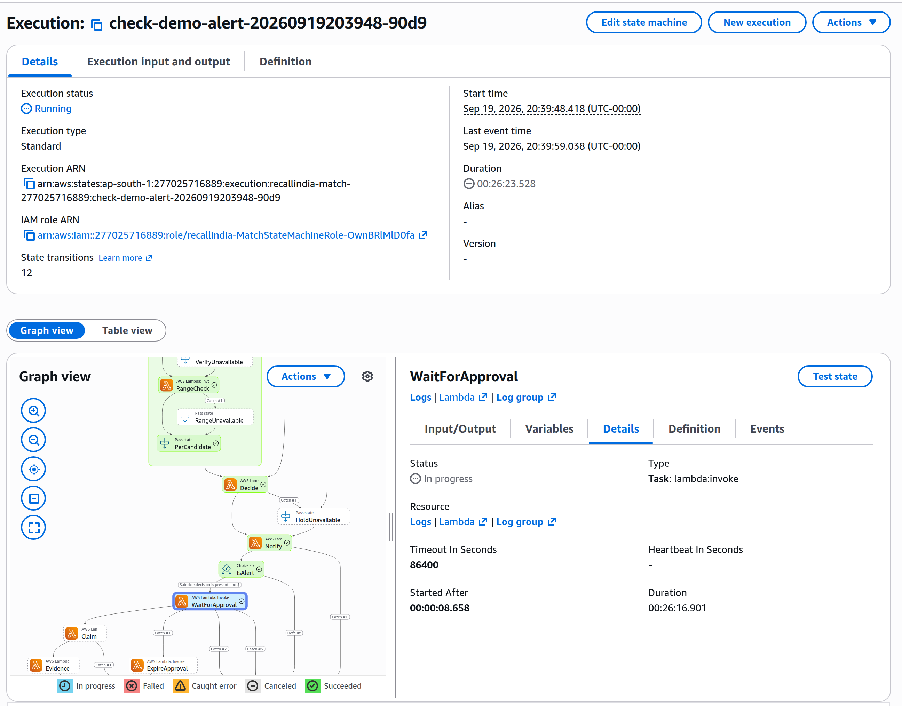

# RecallIndia

**India publishes recalls as PDFs nobody reads. RecallIndia tells you the day something you own is on one.**

- **Live:** https://recallindia.d2jn22qjgettr5.amplifyapp.com
- **Public API:** https://ilbmeuwrt7.execute-api.ap-south-1.amazonaws.com/v1/notices
- **Video:** _(link to follow)_
- Built for the WeMakeDevs × AWS **First Commit** hackathon, 17–20 Sep 2026.



| A government PDF becoming the feed | Something you own, on a notice |
|---|---|
|  |  |

| The case: approve, seal, write, verify | The tamper test |
|---|---|
|  |  |

---

## Idea and Impact

India has **no central recall database and no consumer notification mechanism**. Manufacturers
tell the regulator, and that is where it stops.

- CDSCO publishes a monthly list of drugs that **failed quality tests** ("Not of Standard
  Quality") — as PDFs until June 2025, as a searchable web table since. In **July 2026, 239
  samples failed**, 20 of them paracetamol. Nobody turns that list into an alert for the person
  holding the strip.
- SIAM's voluntary vehicle portal lists **38 lakh vehicles** recalled since 2012, checkable only
  by typing a VIN into a form.
- CPSC's own research: direct notification lifts recall response from **57% to 74%**, and
  registration raises return rates by 24 points. India has neither.
- Amazon notifies customers about recalls of things bought on Amazon. This is for **everything
  Amazon cannot see**: the pharmacy counter, the dealer, the local shop.

RecallIndia polls the regulators, turns every notice into one structured record, and matches it
against the things a household registers. When something matches, a human approves, and the
system seals the evidence and writes the claim letter.

## Built on AWS



| Service | What it does here | Where it shows in the video |
|---|---|---|
| **EventBridge Scheduler** | Polls CPSC, NHTSA and openFDA every 15 minutes; CDSCO's portal daily. | 0:35 (the feed's "last poll") |
| **Lambda** (Python 3.12) | Every poller, every pipeline step, and the single API handler. | throughout |
| **Textract** | `AnalyzeDocument` TABLES turns a CDSCO alert PDF into rows; `DetectDocumentText` reads the batch off a strip photo. | 0:10 (`/ingest`), 0:48 (scan) |
| **Step Functions** | The match pipeline, and the human gate: an alert parks on a **task token** until a person answers. | 1:20, and the console cutaway |
| **DynamoDB** | Notices, items and cases; every read is an index query, never a scan. | throughout |
| **S3 Object Lock** | The notice snapshot, written once in GOVERNANCE mode and retained 30 days. | 1:20 (certificate) |
| **KMS** | An asymmetric RSA_2048 key signs the snapshot's SHA-256. The private half never leaves KMS. | 1:20 (VERIFIED / INVALID) |
| **API Gateway** (HTTP API) | The public `/v1` feed and the household routes, CORS open, no key. | 2:14 (`/api`) |
| **Amplify Hosting** | The Next.js static export. | every shot |
| **Comprehend** | Entity spans when a household pastes a list of products. | — |

**No model is in the decision path.** Candidates, verification, the range check, the decision and
the claim letter are deterministic Python and a Jinja2 template. Bedrock is implemented behind
`BEDROCK_ENABLED` and is off (quota denied on this account for the whole hackathon).

## Learning

**Textract tables.** The first CDSCO archive PDF came back as 57 table rows, and the naive
reading of them produced 57 notices — except two of those "rows" were continuation lines, where a
manufacturer's address wrapped. Rows have to be stitched by geometry before they mean anything:
the run reports `57 rows → 55 notices`, and the two merged rows carry `merged_into` so the replay
can show what happened. The fallback matters too: older layouts return fewer than five Textract
rows, and `pdfplumber` takes over.

**Step Functions task tokens.** A boolean `approved` flag on a row is not a gate — code can skip
it. `lambda:invoke.waitForTaskToken` is, because the next state does not exist until somebody
calls `SendTaskSuccess`. The part that took the longest was making the answer safe: the token is
spent inside one conditional DynamoDB update (`status: waiting_approval → approving`), and Step
Functions is only called after that write wins. A second approve, an approve racing a reject, and
an approve after the 24-hour timeout all lose the condition and get a 409 with the case as it
stands. Retries had to be narrowed too — retrying `States.ALL` on the wait would have reopened a
rejection.

**Object Lock + KMS.** Storing a hash in the database proves nothing: whoever can change the file
can change the hash. The snapshot goes to a versioned bucket with Object Lock in GOVERNANCE mode
for 30 days, and its SHA-256 is signed by a KMS key whose private half we never hold. Two things
surprised me: an Object Lock PUT needs an explicit checksum, and the lock lives on the *version*,
so every read back has to name the `VersionId` or it proves nothing about the object that was
signed. The tamper test flips one byte of the downloaded copy in memory — nothing stored changes,
and the signature stops matching.

## Execution

What works end to end, live, right now:

| Demo shot | Route | What it proves |
|---|---|---|
| 0:10 | `/ingest?replay=…` | A real CDSCO PDF read by Textract, each row lifting off the page into the feed |
| 0:35 | `/` | Four pollers, one feed, counts and health from `/v1/stats` |
| 0:48 | `/mine` | A photo → Textract → the batch on a foil chip → checked → clear |
| 1:03 | `/mine` | Batch FT5427 flips the card red, with the regulator's own row quoted |
| 1:20 | `/case/?id=` | The gate, the seal, the letter, VERIFIED, the tamper test, INVALID |
| 1:52 | `/mine` | The near miss: one character different, dismissed with the reason |
| 2:14 | `/api` | The same feed as JSON, in one request |

```
$ make validate-live
validate: own household hh_… with 15 copied things
counts: {'alert': 2, 'hold': 0, 'dismiss': 1, 'clear': 12}  took=12.1s
PASS

$ .venv/bin/python -m pytest -q
857 passed
```

**The human gate is real.** While a case waits, the execution is parked:

```
$ aws stepfunctions get-execution-history --execution-arn …check-demo-alert-…
(41, TaskStateEntered, WaitForApproval) (42, TaskScheduled) (43, TaskStarted) (44, TaskSubmitted)
TaskSucceeded present: False | status: RUNNING
```

Approving on `/case` resumes it, and the four steps finish in about nine seconds:
`approving → sealing → writing_letter → verifying → verified`.

**The evidence is real.** On the snapshot of a case approved live:

```
$ aws s3api get-object-retention --bucket recallindia-evidencebucket-… --key evidence/<case>/<sha>.bin --version-id <v>
{ "Retention": { "Mode": "GOVERNANCE", "RetainUntilDate": "2026-10-20T00:03:36+00:00" } }

$ aws s3api delete-object --bucket … --key … --version-id …      # no bypass, account admin
An error occurred (AccessDenied) when calling the DeleteObject operation:
Access Denied because object protected by object lock.
```



## What's real, and what isn't

Real: every notice (CDSCO portal and archive PDFs, CPSC, NHTSA, openFDA), the Textract reads, the
matching rules, the task-token gate, the Object Lock snapshot, the KMS signature and the claim
letter PDF. The 15 demo items are seeded, and the case a visitor opens from the demo wall
(`case_demo_ft5427`) was sealed by the same pipeline.

Not real: nothing is sent anywhere. The letter is a PDF you download and hand over; there is no
post, no email to the seller. Alert email to the owner is wired to SES but the identity is still
unverified in `ap-south-1`, so it is logged as `email.skipped` and never fails a run.

## Limitations

- **No accounts.** A household id in `localStorage` scopes the wall (`X-Household`); the demo
  household is read-only. Anyone with an id can act as that household — fine for a public demo
  with per-household caps, not for real data. ([ADR-008](docs/adr/ADR-008-task-token-gate-and-households.md))
- **NHTSA matches by make, model and year**, not VIN, so a vehicle card says to confirm with the
  dealer.
- **CDSCO's PDF layouts drift**; Textract is primary and `pdfplumber` is the fallback, and a page
  that beats both shows the committed poster instead of failing.
- **SIAM** (Indian vehicle recalls) is not ingested; NHTSA stands in for the vehicle path.
- **Object Lock is GOVERNANCE**, not COMPLIANCE, so an administrator with the bypass permission
  can clean the account up. Production would use COMPLIANCE and a longer retention.
- **SES identity unverified**, so no alert email leaves the account yet.

## Quickstart

```bash
make install                 # venv, dev deps, npm ci, pre-commit
DEMO_MODE=1 make test        # 857 tests against fixtures; no AWS credentials needed
make app-dev                 # the app against the deployed API
```

Deploy (everything is one SAM stack plus an Amplify manual deployment):

```bash
make deploy                  # sam build && sam deploy   (profile firstcommit, ap-south-1)
make app-deploy              # static export -> Amplify
make seed-live               # the 15 demo items + the demo case, reset
make validate-live           # PASS/FAIL against the live API, in its own household copy
```

## Decisions

- [ADR-001 — rules decide, the model only explains](docs/adr/ADR-001-rules-decide-model-explains.md)
- [ADR-002 — Step Functions over a custom loop](docs/adr/ADR-002-step-functions-over-custom-loop.md)
- [ADR-003 — CDSCO: two adapters, one notice shape](docs/adr/ADR-003-cdsco-two-adapters.md)
- [ADR-004 — idempotent upserts and poller metadata](docs/adr/ADR-004-pollers-idempotent-upsert-and-meta.md)
- [ADR-005 — index-only listing and cursor pagination](docs/adr/ADR-005-source-index-and-cursor-pagination.md)
- [ADR-006 — a Decide Lambda, and what "clear" means](docs/adr/ADR-006-decide-lambda-and-clear-outcome.md)
- [ADR-007 — Object Lock + KMS instead of a hash in the database](docs/adr/ADR-007-object-lock-kms-evidence.md)
- [ADR-008 — a task-token gate and household scoping instead of accounts](docs/adr/ADR-008-task-token-gate-and-households.md)

Specs: [SPEC.md](SPEC.md) (sources, data model, pipelines) · [UI-SPEC.md](UI-SPEC.md) (screens,
states, motion) · [DESIGN.md](DESIGN.md) (tokens) · [DEMO_SCRIPT.md](DEMO_SCRIPT.md) (scope) ·
[docs/P00-REPORT.md](docs/P00-REPORT.md) (what was verified against the real endpoints).

## AI tools used

Built with **Claude Code (Claude, Anthropic)** as the coding assistant, per the hackathon's
disclosure rule. The product itself uses no language model in its decision path.
